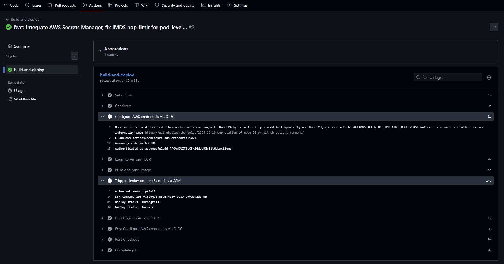
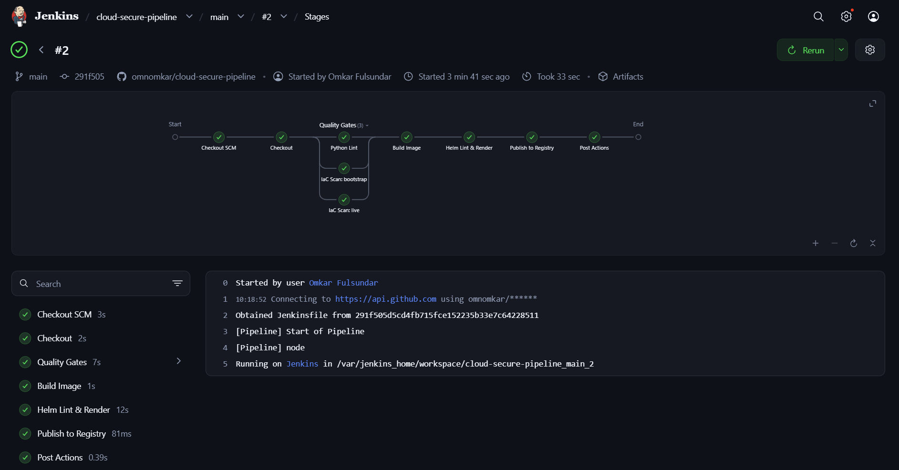
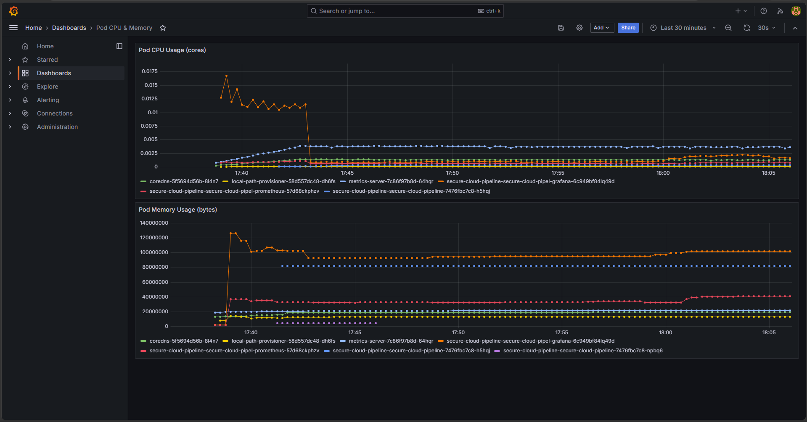
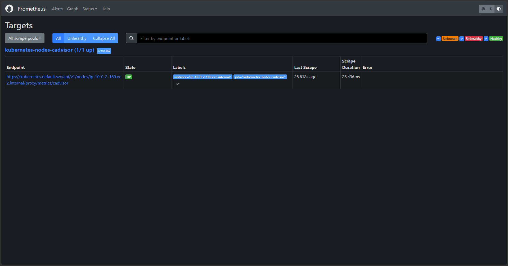
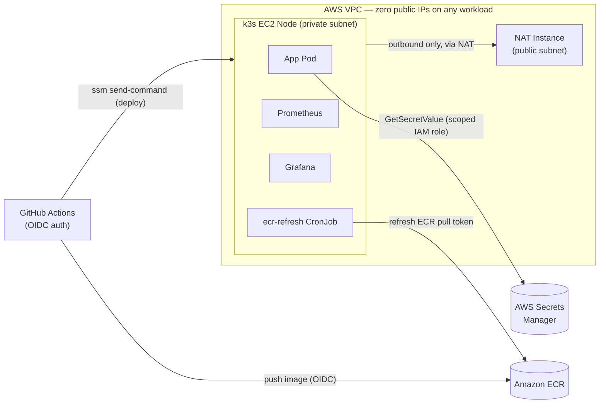

# secure-cloud-pipeline


*The k3s node's security group has no ingress rules and the instance has no public IP — yet a shell lands on it via SSM Session Manager, three workloads are running, and the app returns a secret read from AWS Secrets Manager over IMDS.*

<table>
  <tr>
    <td width="50%" align="center">
      <a href="demo/actions-ssm-deploy.png"></a>
      <br><sub><b>GitHub Actions → ECR → SSM deploy.</b> No AWS access keys anywhere; <code>helm upgrade</code> runs on the node through <code>ssm:SendCommand</code>, polled until it reports Success.</sub>
    </td>
    <td width="50%" align="center">
      <a href="demo/jenkins-pipeline.png"></a>
      <br><sub><b>The same gates, rebuilt on Jenkins.</b> <code>ruff</code> and both Checkov scans fanned out in parallel, then build and chart render — every gate a throwaway container.</sub>
    </td>
  </tr>
  <tr>
    <td width="50%" align="center">
      <a href="demo/grafana-pod-resources.png"></a>
      <br><sub><b>Grafana, pre-provisioned by the chart.</b> The Pod CPU &amp; Memory dashboard and its datasource ship with the release — no manual import, no public endpoint.</sub>
    </td>
    <td width="50%" align="center">
      <a href="demo/prometheus-targets.png"></a>
      <br><sub><b>Prometheus scraping kubelet.</b> The node is discovered through the Kubernetes API and cAdvisor reached via the <code>nodes/proxy</code> subresource, on a read-only ClusterRole.</sub>
    </td>
  </tr>
</table>

A security-conscious cloud infrastructure portfolio project. The goal is to
show what "least privilege by default" looks like end-to-end — network,
compute, CI/CD, and secrets — while keeping monthly cost low enough to run
indefinitely as a personal project.

## Project summary

This project demonstrates security-first cloud infrastructure: least-privilege
IAM throughout, zero public IPs or open inbound ports anywhere in the account,
and short-lived credentials end-to-end — OIDC for CI/CD, IMDS for the app,
SSM for shell access, no static AWS keys, no SSH keys. It's equally
cost-conscious by design: a NAT instance instead of a NAT Gateway, k3s
instead of EKS, hand-written manifests instead of a third-party Helm chart
for monitoring — each tradeoff explained where it's made, not just listed.
The CI logic is deliberately portable: the same gate structure runs both as
a GitHub Actions workflow and as a self-hosted Jenkins pipeline, so nothing
here depends on one vendor's runner. And it's a record of real debugging,
not just a finished diagram: seven concrete, production-grade issues — an
OIDC trust-policy bug, a cgroup v1/v2 incompatibility, a Helm naming-limit
collision, among others — were hit and fixed while building this, detailed
in **Lessons learned** below.

The recordings and screenshots throughout this README were captured against
live infrastructure in August 2026; it was torn down afterward to avoid
ongoing cost, so there's no live demo link. The diagram, the Lessons learned
section, and the infrastructure code itself cover the parts a recording
can't show — see "Redeploying this project" further down if you want to
stand it back up.

## Architecture diagram



No inbound security group rule exists anywhere in this diagram — the only
path into the private subnet is GitHub Actions' `ssm:SendCommand` call,
itself scoped to one instance and one SSM document (see "Why OIDC instead
of access keys" below).

## Lessons learned

Seven real issues surfaced while building this, each fixed in the code
rather than worked around:

- **k3s install failing on a SELinux RPM lookup.** The install script tries
  to install a `k3s-selinux` RPM matched to the host OS; Amazon Linux 2023
  didn't have one published at the pinned k3s version, so the step had
  nothing valid to install. Fixed by passing
  `INSTALL_K3S_SKIP_SELINUX_RPM=true` to the installer in
  `live/templates/k3s-user-data.sh.tpl` — SELinux enforcement isn't part of
  this project's threat model anyway, so skipping it costs nothing.
- **cgroup v1/v2 mismatch with Kubernetes 1.36.** k3s v1.36+ fully dropped
  cgroup v1 support, but Amazon Linux 2 — the AMI used everywhere else in
  this project, including the NAT instance — defaults to cgroup v1, so k3s
  wouldn't start cleanly on it. Diagnosed by checking k3s's own release
  notes against the AMI's default cgroup driver, then fixed by giving the
  k3s node its own AMI lookup pinned to Amazon Linux 2023 (cgroup v2 by
  default) in `live/k3s_instance.tf`, separate from the NAT instance's AMI.
- **AL2023's "minimal" AMI variant has no SSM agent.** AWS publishes more
  than one AL2023 AMI family; the minimal variant strips out preinstalled
  agents — including the SSM agent — to shrink image size. On a node with
  zero inbound security group rules and no SSH, a missing SSM agent means
  no path in at all: the instance boots but never appears as a "Managed
  Instance." Fixed by pinning the AMI filter to the standard (non-minimal)
  AL2023 family, which ships the agent preinstalled.
- **GitHub OIDC role rejected despite a correct trust policy.** The IAM
  role's trust policy had the right OIDC provider, the right `sub`/`aud`
  conditions, scoped to the right repo and branch — and AWS still denied
  every assume-role attempt. The `Action` was `sts:AssumeRole`, the call
  used for ordinary cross-account role chaining, instead of
  `sts:AssumeRoleWithWebIdentity`, the specific STS API a `Federated` OIDC
  principal must call; IAM matches trust policies against the exact action
  requested, so the near-identical-sounding action was an outright denial,
  not a permissions gap. Fixed in `live/oidc.tf`.
- **EKS-only ECR auth doesn't exist on a self-managed cluster.** Pods sat in
  `ImagePullBackOff` despite the node's IAM role having correct ECR pull
  permissions, on the assumption that containerd would pick up that role
  automatically the way EKS's ECR credential helper does. That integration
  is EKS-specific — stock containerd/k3s has no equivalent. Fixed by adding
  an explicit `ecr-pull-secret` `imagePullSecrets` entry to
  `deployment.yaml`, refreshed automatically since ECR tokens expire after
  ~12h (see "Keeping `ecr-pull-secret` fresh" below).
- **Helm CronJob name overflow collided with the app's own Service.** The
  chart's standard `<release>-<chart>-...` naming pattern, applied to the
  `ecr-refresh` CronJob, pushed the generated name past Kubernetes' object
  name limits; separately, the CronJob's pod template reused the chart's
  shared `selectorLabels` helper, which is the exact label set the app's
  `Service` selects on — so a running CronJob pod started absorbing traffic
  meant for the app, despite not listening on port 5000. Fixed by
  truncating the CronJob/ServiceAccount names with `trunc 40 | trimSuffix
  "-"` before appending suffixes, and giving the CronJob's pods their own
  distinct labels instead of reusing the app's selector labels — both in
  `helm/secure-cloud-pipeline/templates/ecr-secret-cronjob.yaml`.
- **Docker bind mounts inside a containerized Jenkins resolve against the
  host, not the container.** The `Jenkinsfile` runs each tool as a
  throwaway container (`docker run -v "$PWD":/src ...`), with Jenkins
  itself containerized and driving Docker through the mounted host socket.
  Every mount silently came up empty — Checkov reported `/src/live does not
  exist`, Ruff failed on a path that was plainly there. The cause is that
  `docker run -v` is interpreted by whichever daemon receives it: the
  *host's* daemon, which resolves `$PWD` (`/var/jenkins_home/workspace/...`)
  against the host filesystem, where that path didn't exist because Jenkins'
  home was an internal Docker volume. Nothing errors — a non-existent source
  path just mounts as empty. Fixed by bind-mounting the Jenkins home to the
  *identical* absolute path on both sides (`-v /var/jenkins_home:/var/jenkins_home`),
  so a workspace path means the same thing to Jenkins and to the host daemon.

## Architecture details

- **Compute**: single-node [k3s](https://k3s.io/) on one EC2 instance running
  a Python Flask app, instead of EKS — avoids the ~$73/mo EKS control plane
  fee while still using real Kubernetes primitives.
- **Network**: the k3s instance sits in a **private subnet**, single AZ,
  `us-east-1`. The only way out to the internet is a small NAT **instance**
  (~$5-10/mo on `t3.nano`) in a public subnet — not a managed NAT Gateway,
  which would cost more than the workload it's serving.
- **Access**: no SSH, no open inbound ports anywhere. All shell access goes
  through **AWS SSM Session Manager**, which only requires outbound HTTPS
  and an IAM role — no keys to lose, no bastion to patch.
- **CI/CD**: GitHub Actions authenticates to AWS via **OIDC** (no long-lived
  AWS credentials stored in GitHub). It builds and pushes images to
  **Amazon ECR**, then deploys by sending a command through **SSM
  send-command** — the Kubernetes API server is never exposed to the
  internet.
- **Deployment**: app manifests are packaged as **Helm charts**.
- **Secrets**: application secrets live in **AWS Secrets Manager**; the
  instance's IAM role is scoped to read only the specific secrets it needs.
- **Monitoring**: self-hosted **Prometheus + Grafana**, running as workloads
  on the same k3s node (no separate observability infrastructure to pay for).
- **Terraform state**: remote state in an **S3 bucket** (versioned,
  encrypted, public access blocked) with a **DynamoDB table** for locking.

## Repository layout

```
bootstrap/   Standalone Terraform that creates the S3 bucket + DynamoDB
             table used as the remote backend for everything else. Run
             once, with local state, before touching live/.
live/        The actual infrastructure: network, NAT instance, k3s host,
             ECR repository, and GitHub OIDC IAM role - using the S3
             backend bootstrap/ created.
app/         The Flask app that will eventually run on the k3s node.
Dockerfile   Builds app/ into a container image (build context is the
             repo root - see "The Flask app" section below).
helm/        Helm chart that deploys the Flask app onto the k3s node.
.github/     GitHub Actions workflow that builds/pushes the image via
             OIDC and triggers a deploy over SSM (no exposed k8s API).
Jenkinsfile  A second, independent implementation of the same CI gates on
             Jenkins - proves the pipeline logic isn't tied to one CI
             platform (see "Portable CI" below).
```

`bootstrap` and `live` are deliberately separate Terraform root modules:
`live` depends on a backend that has to exist *before* `live` can run, so
it can't create its own backend without a chicken-and-egg problem.

## Phase status

- [x] **Phase 1 — Network + NAT instance + state backend**
  - `bootstrap/`: S3 state bucket + DynamoDB lock table
  - `live/`: VPC, public/private subnets, IGW, route tables, NAT instance
    (SSM-only access, IMDSv2 enforced, encrypted root volume, no SSH)
- [x] **Phase 2 — Flask app + container image**
  - `app/`: minimal Flask app with `/`, `/health`, and `/config` routes
  - Root `Dockerfile`: non-root, gunicorn-served container image
- [x] **Phase 3 — k3s node + ECR repository** (this commit)
  - `live/ecr.tf`: ECR repository (scan-on-push, 5-image lifecycle policy)
  - `live/k3s_instance.tf`: k3s node in the private subnet (SSM-only
    access, zero-ingress security group, least-privilege ECR pull IAM,
    IMDSv2 enforced, encrypted root volume, pinned k3s version)
- [x] **Phase 4 — GitHub Actions OIDC role, Helm chart, deploy via SSM
      send-command** (this commit)
  - `live/oidc.tf`: GitHub OIDC provider + an IAM role scoped to this
    repo's `main` branch only, least-privilege ECR push + SSM deploy policy
  - `helm/secure-cloud-pipeline/`: Helm chart for the Flask app
  - `.github/workflows/deploy.yml`: builds/pushes the image via OIDC, then
    deploys it by sending a script through SSM - no exposed k3s API
- [x] **Phase 5 — Secrets Manager integration, least-privilege IAM for app**
      (this commit)
  - `live/secrets.tf`: Secrets Manager secret for the app's runtime
    message, plus a `secretsmanager:GetSecretValue` grant on the k3s
    node's existing IAM role, scoped to that one secret's ARN
  - `live/k3s_instance.tf`: `http_put_response_hop_limit = 2` so IMDS is
    reachable from inside a pod, not just from the host (see the
    dedicated gotcha section below)
  - `app/app.py`: reads the secret from Secrets Manager via boto3 at
    startup when `SECRETS_MANAGER_SECRET_NAME` is set, falls back to the
    Phase 2 behavior when it isn't
  - `helm/secure-cloud-pipeline/templates/ecr-secret-cronjob.yaml` +
    `serviceaccount.yaml`: closes the gap from Phase 4's `imagePullSecrets`
    fix — a CronJob refreshes `ecr-pull-secret` every 6h from inside the
    cluster, with RBAC scoped to that one Secret (see "Keeping
    `ecr-pull-secret` fresh" below)
- [x] **Phase 6 — Prometheus + Grafana on the cluster** (this commit)
  - `helm/secure-cloud-pipeline/templates/monitoring/prometheus.yaml`:
    hand-written Prometheus Deployment + ConfigMap + ClusterIP Service,
    with cluster-wide RBAC for Kubernetes service discovery
  - `helm/secure-cloud-pipeline/templates/monitoring/grafana.yaml`:
    hand-written Grafana Deployment, pre-provisioned with the Prometheus
    datasource and one pod CPU/memory dashboard, password from a
    Kubernetes Secret
  - Both reachable only via `kubectl port-forward` — see "Monitoring:
    Prometheus + Grafana" below
- [x] **Phase 7 — The same CI gates, rebuilt on Jenkins**
  - `Jenkinsfile`: declarative Jenkins pipeline running the same lint,
    IaC-scan, build, and chart-render gates as `.github/workflows/deploy.yml`,
    with the three independent gates fanned out in parallel
  - Every tool invoked as a throwaway container, so the Jenkins agent needs
    nothing installed but a Docker CLI and a socket — see "Portable CI"
    below

All seven phases are complete.

## Redeploying this project

The infrastructure described below was torn down after this project was
finished, to avoid ongoing AWS cost — these are the steps to stand it back
up from scratch, not instructions for reaching anything currently running.

1. **Create the state backend** (uses local state, since it's creating the
   backend itself):
   ```
   cd bootstrap
   terraform init
   terraform apply -var="bucket_name=<your-globally-unique-bucket-name>"
   ```
   Note the `state_bucket_name` and `dynamodb_table_name` outputs.

2. **Point `live/` at that backend** — edit `live/providers.tf` and replace
   `REPLACE_WITH_YOUR_STATE_BUCKET_NAME` and
   `REPLACE_WITH_YOUR_LOCK_TABLE_NAME` with the values from step 1.

3. **Set your variables**:
   ```
   cd ../live
   cp terraform.tfvars.example terraform.tfvars
   # edit terraform.tfvars — at minimum set project_name
   ```

4. **Provision**:
   ```
   terraform init
   terraform plan
   terraform apply
   ```

5. To reach the NAT instance (or, later, the k3s host) for debugging, use
   SSM Session Manager — `aws ssm start-session --target <instance-id>` —
   never SSH.

## The Flask app (Phase 2)

`app/app.py` is a minimal Flask app with three routes:

- `GET /` — returns a small JSON status payload.
- `GET /health` — returns `{"status": "healthy"}`; this is what k3s will
  point liveness/readiness probes at in Phase 3.
- `GET /config` — returns a message read from the `APP_SECRET_MESSAGE`
  environment variable, falling back to a default if it isn't set. This is
  a stand-in for the real AWS Secrets Manager read that Phase 4 will add —
  same shape (an env var the app trusts), different source.

### Running it locally

Without Docker, using Flask's own dev server:

```
cd app
pip install -r requirements.txt
python app.py
```

The app listens on `http://localhost:5000`.

### Building the container image

The `Dockerfile` lives at the repo root (not in `app/`) so its build
context is the whole repo and `.dockerignore` can exclude things like
`bootstrap/`, `live/`, and `.terraform/` that have nothing to do with the
app image:

```
docker build -t secure-cloud-pipeline-app .
docker run -p 5000:5000 secure-cloud-pipeline-app
```

## The k3s node and ECR (Phase 3)

`live/ecr.tf` creates one ECR repository (`<project_name>-app`) with image
scanning on push and a lifecycle policy that expires anything past the 5
most recent images, so storage cost doesn't grow unbounded as CI pushes
new builds.

`live/k3s_instance.tf` creates the node k3s actually runs on:

- It lands in `aws_subnet.private` from Phase 1 — never gets a public IP,
  and all of its outbound traffic (to ECR, to the SSM endpoints) is routed
  out through the NAT instance via the private route table.
- Its security group has **zero ingress rules** on purpose — SSM Session
  Manager only needs outbound connectivity from the instance, so there is
  nothing to open inbound. This is the same access model as the NAT
  instance, applied to the workload node.
- Its IAM role can do exactly two things: register with SSM
  (`AmazonSSMManagedInstanceCore`), and pull from this one ECR repository
  (`ecr:BatchGetImage`, `ecr:GetDownloadUrlForLayer` scoped to the repo's
  ARN, plus the unavoidable wildcard-resource `ecr:GetAuthorizationToken`
  that AWS requires for any ECR pull). It cannot push images, touch other
  repositories, or do anything else in the account.
- `user_data` installs k3s pinned to `var.k3s_version` (default
  `v1.36.2+k3s1`) via the official install script, disables the bundled
  Traefik ingress controller (unused here), and writes
  `/var/log/k3s-install-done` once the script finishes successfully — a
  way to confirm over SSM that install actually completed, not just that
  the instance booted.

### Reaching the k3s API from your laptop

This is a manual step you run yourself after `apply` — Terraform doesn't
(and can't) automate it, since it depends on the instance actually being
up and k3s having finished installing:

```
# 1. Forward local port 6443 to the k3s node's port 6443 over SSM
#    (no inbound security group rule needed - SSM does this over its own
#    outbound-only agent connection):
aws ssm start-session \
  --target <k3s_instance_id> \
  --document-name AWS-StartPortForwardingSession \
  --parameters '{"portNumber":["6443"],"localPortNumber":["6443"]}'

# 2. In a separate terminal, grab the kubeconfig from the node (e.g. via
#    a normal `aws ssm start-session` shell): sudo cat /etc/rancher/k3s/k3s.yaml
#    k3s writes that file pointing at https://127.0.0.1:6443 by default,
#    which lines up with the port you just forwarded - copy it locally
#    and use it as-is.
kubectl --kubeconfig ./k3s.yaml get nodes
```

## CI/CD: GitHub Actions OIDC, Helm, and SSM deploy (Phase 4)

### Why OIDC instead of access keys

`live/oidc.tf` creates an `aws_iam_openid_connect_provider` trusting
`token.actions.githubusercontent.com` (GitHub's own OIDC issuer), plus an
IAM role that workflow can assume by presenting a token from that issuer.
The role's trust policy doesn't just check *who* the issuer is — it checks
the token's `sub` claim against
`repo:${var.github_org}/${var.github_repo}:ref:refs/heads/main` exactly.
That means a workflow run from a fork, a feature branch, or someone else's
repo entirely gets rejected by AWS before it can make a single API call.
No AWS access key or secret is ever generated, stored as a GitHub secret,
or capable of leaking from a log — each workflow run gets credentials that
expire with the job.

The role's inline policy (also in `oidc.tf`) is narrow on purpose:

- `ecr:GetAuthorizationToken` on `*` — unavoidable; AWS doesn't support
  resource-level scoping for this action (same as the k3s node's pull
  policy in Phase 3).
- `ecr:BatchCheckLayerAvailability` / `PutImage` / `InitiateLayerUpload` /
  `UploadLayerPart` / `CompleteLayerUpload` — scoped to this one ECR
  repository's ARN. The role can push images here and nowhere else.
- `ssm:SendCommand` — scoped to *two* specific ARNs in one statement: the
  k3s instance itself, and the `AWS-RunShellScript` document. It can't
  send a command to any other instance in the account, and can't use any
  other SSM document.
- `ssm:GetCommandInvocation` on `*` — this one can't be scoped tighter:
  AWS generates the command ID at `SendCommand` time, so there's no ARN to
  reference in advance.

### The Helm chart

`helm/secure-cloud-pipeline/` packages the Flask app as a standard chart:
a `Deployment` with `livenessProbe`/`readinessProbe` both hitting `GET
/health` (the same endpoint added in Phase 2), a `ClusterIP` `Service` on
port 5000 (matching the Dockerfile's `EXPOSE`), and `_helpers.tpl` for
conventional resource naming. `APP_SECRET_MESSAGE` is wired in via
`values.yaml` as a plain value for now — Phase 5 swaps that for a
Secrets Manager read without changing the chart's shape. Resource
requests/limits are sized small on purpose (100m/128Mi requests,
250m/256Mi limits) so a single pod doesn't crowd out k3s's own system pods
on a `t3.small`.

> **Correction:** an earlier version of this section claimed no
> `imagePullSecrets` was needed because containerd would pick up the node's
> IAM role automatically, the way EKS does. That's wrong — automatic
> IAM-role-based ECR auth is an EKS-specific integration, not something
> stock containerd/k3s does on its own. `deployment.yaml` now references
> an `ecr-pull-secret` image pull secret instead, kept fresh by a CronJob —
> see "Keeping `ecr-pull-secret` fresh" below.

### Keeping `ecr-pull-secret` fresh

A Kubernetes image pull secret holding an ECR token doesn't stay valid —
ECR tokens expire after ~12h, so creating it once (by hand, or via a
one-time Terraform provisioner) just defers the `ImagePullBackOff` instead
of preventing it. A provisioner has the same problem twice over: it would
also depend on the SSM port-forward tunnel and `KUBECONFIG` being active
at the exact moment `terraform apply` runs, which is its own source of
flakiness.

Instead, `helm/secure-cloud-pipeline/templates/ecr-secret-cronjob.yaml`
runs **inside the cluster** every 6 hours (comfortably inside the ~12h
token life) and re-creates the secret from scratch:

1. Fetches a fresh ECR token with `aws ecr get-login-password`.
2. Turns it into a `kubernetes.io/dockerconfigjson` secret via
   `kubectl create secret docker-registry ... --dry-run=client -o yaml |
   kubectl apply -f -` — the dry-run-then-apply pattern makes this
   idempotent. It overwrites `ecr-pull-secret` in place on every run
   instead of erroring because it already exists, which also means **no
   manual cleanup is needed** if a secret of that name already exists from
   being created by hand before this CronJob existed — the next run just
   takes over managing it.

Two things make this work without any new IAM or credentials:

- **AWS credentials**: this is a single-node cluster, so the CronJob's pod
  runs on the same EC2 instance whose IAM role already has
  `ecr:GetAuthorizationToken` (granted in Phase 3, `Resource "*"` — the
  only action `get-login-password` calls). The AWS CLI's default
  credential chain reaches that role over IMDS exactly the way the app's
  boto3 calls do, both depending on the `http_put_response_hop_limit = 2`
  fix from Phase 5 to cross the one extra host-to-pod network hop. No new
  IAM permission, and no Kubernetes Secret holding AWS credentials, is
  needed for this CronJob at all.
- **Cluster credentials**: `kubectl` auto-detects in-cluster config from
  the pod's mounted ServiceAccount token, so no kubeconfig file is needed
  inside the container — unlike the SSM deploy script, which runs
  directly on the host and does need `/etc/rancher/k3s/k3s.yaml`. RBAC for
  that ServiceAccount (`templates/serviceaccount.yaml`) is scoped to
  exactly one Secret by name: it can `create` Secrets in this namespace
  (RBAC `resourceNames` can't restrict `create` — there's no existing
  object yet to check the name against) but `get`/`update`/`patch` are
  pinned to `ecr-pull-secret` specifically, so it can't touch any other
  Secret in the namespace.

`kubectl` itself isn't part of the `aws-cli` base image, so the CronJob
fetches it via `curl` at runtime — the same on-demand-binary pattern the
SSM deploy script already uses to bootstrap Helm, rather than maintaining
and publishing a custom image just to bundle two CLIs together.

One practical gap: a CronJob doesn't run immediately when it's first
created, only at its next scheduled tick — so on a brand-new cluster with
no pre-existing `ecr-pull-secret`, the very first deploy's pod can sit in
`ImagePullBackOff` for up to 6h until the CronJob's first run. Trigger it
once by hand to skip that wait (the CronJob is named
`<release-name>-secure-cloud-pipeline-ecr-refresh` — `secure-cloud-pipeline-secure-cloud-pipeline-ecr-refresh`
for the release name used in `deploy.yml`; run `kubectl get cronjob` to
confirm):
```
kubectl create job --from=cronjob/secure-cloud-pipeline-secure-cloud-pipeline-ecr-refresh \
  ecr-refresh-bootstrap
```

### How a deploy actually happens

There's no Kubernetes API exposed to the internet, so the workflow can't
just `kubectl apply` or `helm upgrade` directly from GitHub's runners. Two
things make this work:

1. **`ssm:SendCommand`** runs a shell script *on* the k3s node itself,
   over the same SSM channel used for manual debugging access — no new
   network exposure at all.
2. That script can't receive files from the GitHub runner directly (SSM
   only delivers a command, not a working directory), so instead of
   standing up an S3 bucket just to ferry chart files around, it pulls the
   exact commit's source straight from GitHub's public tarball endpoint
   (`codeload.github.com/<org>/<repo>/tar.gz/<sha>`), extracts the
   `helm/` directory, and runs `helm upgrade --install` against it. This
   also guarantees the chart that gets deployed always matches the commit
   that built the image — there's no separate "chart version" to drift out
   of sync.

The script targets the cluster via `KUBECONFIG=/etc/rancher/k3s/k3s.yaml`,
which works without any port-forwarding because it's running *on* the
node — that file already points at `127.0.0.1:6443`. It also checks for
`helm` and installs it via the official install script if missing, rather
than baking that into Phase 3's `user_data` — that would have forced
replacing the already-running instance just to add a CLI tool.

After `ssm send-command` returns a command ID, the workflow polls
`ssm get-command-invocation` every 10 seconds (up to 5 minutes) until the
status is `Success`, or fails the job loudly on `Failed`/`Cancelled`/
`TimedOut` — a deploy script error on the node turns into a red GitHub
Actions run, not a silent no-op.

### Manual setup required (GitHub does this part, not Terraform)

Terraform can create the IAM role, but it can't reach into GitHub's UI to
tell a workflow which role to use — that's a one-time manual step after
`terraform apply`:

1. Run `terraform output github_actions_role_arn` in `live/`.
2. In the GitHub repo: **Settings → Secrets and variables → Actions →
   Variables tab** (not Secrets — this ARN isn't sensitive, it's not
   usable by anyone who isn't already running a workflow on this repo's
   `main` branch) → **New repository variable**.
3. Add these repository variables:
   - `AWS_ROLE_ARN` — the `github_actions_role_arn` output.
   - `AWS_REGION` — same value as `var.region` (e.g. `us-east-1`).
   - `ECR_REPOSITORY` — the repository *name* only (e.g.
     `secure-cloud-pipeline-app`), not the full URL; derive it from the
     `ecr_repository_url` output.
   - `K3S_INSTANCE_ID` — the `k3s_instance_id` output.
   - `SECRETS_MANAGER_SECRET_NAME` — the `app_secret_name` output (added in
     Phase 5; see below).

Once those variables are set, a push to `main` touching `app/**` or
`Dockerfile` triggers the full build-push-deploy pipeline automatically.

## Secrets Manager and the IMDS hop-limit gotcha (Phase 5)

### Wiring the app up to Secrets Manager

`live/secrets.tf` creates one `aws_secretsmanager_secret` (named
`<project_name>-app-secret`) and a version holding `var.app_secret_value`
— a required, `sensitive = true` variable with no default, set only in
your own gitignored `terraform.tfvars`. It also grants the k3s node's
*existing* IAM role (from Phase 3) exactly one new permission:
`secretsmanager:GetSecretValue`, scoped to that one secret's ARN. That
grant is its own `aws_iam_role_policy` resource rather than being folded
into `k3s_instance_ecr` in `k3s_instance.tf` — same role, two policies
attached to it, so the ECR pull policy and the secrets-read policy stay
independently readable and don't need to be touched together.

`app/app.py` reads `SECRETS_MANAGER_SECRET_NAME` once at import time (not
per-request — the value doesn't change without a redeploy, and Secrets
Manager bills per call):

- If that env var **is set**, it fetches the secret via boto3 and uses it
  as `APP_SECRET_MESSAGE`. If the fetch fails for any reason (missing
  permission, wrong secret name, no network path), the app **crashes on
  startup** rather than silently falling back — when this env var is set,
  a working Secrets Manager read isn't optional, and masking a permissions
  problem behind a placeholder string would only delay finding it.
- If it **isn't set**, the app falls back to the Phase 2 behavior
  (`APP_SECRET_MESSAGE` env var, then a literal default) — zero AWS access
  required, so it still runs standalone for local testing.

The Helm chart passes this through as a plain env var
(`secretsManager.secretName` in `values.yaml`, set via `--set` at deploy
time exactly like `image.repository`) — `deployment.yaml` always sets
`SECRETS_MANAGER_SECRET_NAME`, defaulting to an empty string, which the
app treats the same as "not set."

### Gotcha: pods need a higher IMDS hop limit than the host does

This one is easy to lose hours to, so it's called out on its own. EC2's
instance metadata service (IMDS) — which boto3 uses to find credentials
when there's no access key lying around — has a **hop limit**, separate
from `http_tokens` (the IMDSv2 toggle). The default hop limit is **1**,
which only allows IMDS requests that originate directly in the host's own
network namespace.

Once boto3 runs *inside a pod*, it's making that same request from a
*different* network namespace — one hop further from the IMDS endpoint
than the host itself. With a hop limit of 1, that extra hop gets the
packet silently dropped. boto3 doesn't surface "IMDS hop limit too low" as
the error — it just reports something like "Unable to locate credentials,"
which looks identical to a missing/misconfigured IAM role and sends you
debugging the wrong thing.

The fix is one line in `live/k3s_instance.tf`'s `metadata_options` block:
`http_put_response_hop_limit = 2`. That's the minimum needed to cover
host → pod, and no more — it doesn't open IMDS up to anything beyond this
one instance's own workloads.

### Manual setup added in this phase

1. Set `app_secret_value` in your real `terraform.tfvars` (copy it from
   `terraform.tfvars.example` if you haven't already) before running
   `terraform apply` — there's no default, so `apply` will prompt for it
   if it's missing.
2. After `apply`, run `terraform output app_secret_name` and add it as a
   5th GitHub repository variable, `SECRETS_MANAGER_SECRET_NAME` (same
   Settings → Secrets and variables → Actions → Variables tab as the
   other four).

## Monitoring: Prometheus + Grafana (Phase 6)

### Why not the kube-prometheus-stack Helm chart

`kube-prometheus-stack` is the standard way to run Prometheus on
Kubernetes, but it's built for clusters that can absorb its weight:
Alertmanager, kube-state-metrics, node-exporter as a DaemonSet, multiple
CRDs, and the Prometheus Operator reconciling all of it — easily 6+ extra
pods. This is a `t3.small` (2 vCPU, 2GiB RAM) already running k3s's own
system pods, the app pod, and the `ecr-refresh` CronJob; there isn't
memory headroom to spare for an operator stack, and most of what it adds
(alerting, long-term metrics storage, multi-cluster service discovery)
has no use on a single-node demo cluster anyway. It would also be the only
third-party Helm chart in a project where every other workload —
`deployment.yaml`, `ecr-secret-cronjob.yaml` — is a hand-written manifest,
which makes it harder to read end-to-end and to reason about what RBAC
each piece actually needs.

So `templates/monitoring/prometheus.yaml` and `templates/monitoring/
grafana.yaml` are hand-written, in the same style as the rest of this
chart, scoped down to exactly two pods doing exactly one job: collect
basic CPU/memory metrics and show them on one dashboard.

**What's deliberately left out**, compared to the full stack:

- **No Alertmanager** — there's no on-call rotation or pager for a
  portfolio project; alerting rules with nowhere to send them are dead
  weight.
- **No node-exporter DaemonSet** — k3s's kubelet already exposes
  CPU/memory via its built-in cAdvisor endpoint
  (`/metrics/cadvisor`), which is what `prometheus.yml`'s single
  scrape job targets. A DaemonSet for this would be redundant on a
  single-node cluster (it would only ever schedule one pod, same as a
  plain Deployment) and is one more workload to size and patch.
- **No kube-state-metrics** — that exposes Kubernetes *object* state
  (deployment replica counts, pod phase, etc.), not the CPU/memory usage
  this phase asked for. Skipped because it's out of scope, not because it
  was hard.
- **No long-term metrics storage** — `prometheus.yaml` uses `emptyDir`
  with a 6h retention flag, not a PersistentVolumeClaim. There's no
  EBS-backed StorageClass wired up for this single-node cluster, and
  metrics history surviving a pod restart isn't the point of a "proves it
  works" dashboard — see the comments in `prometheus.yaml` and
  `grafana.yaml` for the full reasoning.
- **No public access** — same as everything else in this project: both
  Services are `ClusterIP`, never `LoadBalancer`, and there's no Ingress.
  The only way to reach either UI is the `kubectl port-forward` commands
  below, run from a machine that already has cluster access (see
  "Reaching the k3s API from your laptop" above for how that access is
  set up in the first place).

### RBAC: why Prometheus gets a ClusterRole and the ecr-refresh CronJob doesn't

The `ecr-secret-cronjob.yaml` ServiceAccount only ever touches one Secret
in one namespace, so a namespaced `Role`/`RoleBinding` is the correct,
narrowest scope for it. Prometheus is structurally different: Kubernetes
service discovery means *discovering* every node in the cluster and
proxying to each one's kubelet to scrape `/metrics/cadvisor` — there's no
way to express "watch nodes and proxy to their kubelet" with a namespaced
Role, because nodes aren't namespaced objects at all. `prometheus.yaml`'s
`ClusterRole` grants exactly `get`/`list`/`watch` on `nodes`, `pods`,
`services`, and `endpoints` (for discovery) plus `get` on the `nodes/proxy`
subresource (to actually reach kubelet metrics) — read-only, cluster-wide
because the job is inherently cluster-wide, and nothing more.

### Grafana's admin password

`grafana.yaml` generates an admin password with Helm's `randAlphaNum`
function rather than hardcoding one in a committed file. A naive
`randAlphaNum` call would mint a *new* password on every single `helm
upgrade`, though, locking you out of a cluster you were already logged
into — so the template first does a `lookup` for an existing Secret from a
prior install and reuses its password if found, only generating a fresh
one on a genuinely first install. To pin a specific password instead
(e.g. for a memorable demo), pass `--set
monitoring.grafana.adminPassword=<value>` at deploy time, same pattern as
`image.repository` and `awsRegion` elsewhere in this chart.

### Reaching both UIs locally

Same access model as the k3s API itself (see "Reaching the k3s API from
your laptop" above) — once you have a working `kubeconfig` for the
cluster, port-forward each Service directly with `kubectl`. Both Service
names follow the same `<release-name>-secure-cloud-pipeline-...` pattern
as the `ecr-refresh` CronJob above (and are subject to the same `trunc 40`
truncation caveat) — run `kubectl get svc` first to confirm the exact
names rather than guessing:

```
kubectl get svc

# Prometheus
kubectl port-forward svc/<prometheus-service-name> 9090:9090

# Grafana
kubectl port-forward svc/<grafana-service-name> 3000:3000
```

Then open `http://localhost:9090` (Prometheus) and `http://localhost:3000`
(Grafana — log in as `admin`; the password is in the `*-grafana-admin`
Secret: `kubectl get secret <grafana-admin-secret-name> -o
jsonpath='{.data.admin-password}' | base64 -d`, find the exact Secret name
with `kubectl get secret`). The "Pod CPU & Memory" dashboard is
pre-provisioned and selected by default — no manual data source setup or
dashboard import needed.

## Portable CI: the same gates on Jenkins (Phase 7)

`.github/workflows/deploy.yml` is the pipeline that actually deploys this
project. The root `Jenkinsfile` is a second, independent implementation of
the same gate structure — not a replacement and not a migration.

It exists because the CI logic here is worth being able to move. GitHub
Actions is a hosted runner holding an OIDC trust relationship with AWS, and
a good number of environments can't use one: on-prem toolchains, networks
with no path to a SaaS runner, build steps pinned to licensed software or
physical hardware. Rebuilding the gates on a self-hosted Jenkins is the
honest test of whether the automation was tied to the platform or only to
the tools — and it turned out to be the latter, since every gate is just a
container invocation.

### What it runs

| Stage | What it does |
|---|---|
| Checkout | Clones the commit under test |
| **Quality Gates** (parallel) | `ruff` lint over `app/`; Checkov against `bootstrap/`; Checkov against `live/` |
| Build Image | Builds and tags the app image from the root `Dockerfile` |
| Helm Lint & Render | `helm lint` the chart, then `helm template` it against the new image tag and archive the rendered manifests |
| Publish to Registry | Gated to `main` |

The three quality gates have no dependency on each other, so they run as a
`parallel` block rather than in sequence — wall-clock time for that phase is
the slowest single gate instead of the sum of all three. The two Checkov
runs are split by Terraform root module rather than pointed at the repo root
because `bootstrap/` and `live/` are genuinely separate stacks with
different blast radii (see "Repository layout"), and a failure should say
which one.

Rendering the chart in CI is worth its twelve seconds: `helm template`
against the real image tag catches templating errors — the `trunc 40` name
overflow in **Lessons learned** is exactly this class of bug — before
anything is sent to a cluster, at a point where the only cost of being
wrong is a red build.

### Accepted Checkov findings

Both Terraform stacks pass with zero unaddressed findings. A set of checks
is skipped explicitly via `CHECKOV_SKIPS` in the `Jenkinsfile`, listed in
one place with the reasoning in a comment above it rather than scattered as
inline `# checkov:skip` pragmas across a dozen `.tf` files.

The skips fall into two groups. Some are findings the project's design
deliberately contradicts and would contradict in production too: the NAT
instance *must* have a public IP and open egress, because routing
private-subnet traffic outbound is its entire job (`CKV_AWS_88`,
`CKV_AWS_382`), and the public subnet *is* public by design
(`CKV_AWS_130`). The rest are real hardening that costs money for value a
single-user demo doesn't get — customer-managed KMS keys over AWS-managed
ones, VPC flow logs, S3 cross-region replication and access logging,
DynamoDB point-in-time recovery, EC2 detailed monitoring. Each would be a
straightforward yes in a production account with a compliance driver behind
it; here they'd be spend with no reader.

Suppressing a finding and accepting a finding are different things, and the
distinction only survives if the reasoning is written down next to the
suppression.

### What it deliberately doesn't do

- **No deploy stage.** The GitHub Actions workflow deploys via OIDC and SSM
  `send-command`; the Jenkins `Publish to Registry` stage is a gated stub.
  The AWS infrastructure has been torn down (see "Redeploying this
  project"), and a self-hosted Jenkins has no equivalent of GitHub's OIDC
  identity — authenticating it to AWS would mean either static keys, which
  this project exists to avoid, or IAM Roles Anywhere, which is a
  meaningful chunk of PKI setup for a stage with nothing to deploy to. The
  stage is left in place, `when { branch 'main' }`-gated, with the
  credential-binding pattern in comments.
- **No unit test stage.** `app/` is a three-route Flask app with no test
  suite; a test stage that always passes because it has nothing to run is
  worse than an absent one.
- **No SonarQube or artifact repository.** Both would be another
  long-running service to host for a single-developer project; Checkov and
  `ruff` already cover the gate role.

### Running it yourself

Jenkins runs containerized, driving the host's Docker daemon through the
mounted socket — note that the home directory is bind-mounted to the *same*
absolute path on both sides, which is load-bearing (see the last entry in
**Lessons learned**):

```
sudo mkdir -p /var/jenkins_home && sudo chown $(whoami) /var/jenkins_home

docker run -d --name jenkins -u root -p 8080:8080 \
  -v /var/jenkins_home:/var/jenkins_home \
  -v /var/run/docker.sock:/var/run/docker.sock \
  jenkins/jenkins:lts-jdk17

# the pipeline shells out to `docker`, so the CLI has to exist in the container
docker exec -u root jenkins bash -c "curl -fsSL https://get.docker.com | sh"

docker exec jenkins cat /var/jenkins_home/secrets/initialAdminPassword
```

Then at `http://localhost:8080`: unlock, install the suggested plugins,
create an admin user, and add a **Multibranch Pipeline** pointed at this
repo. It finds the `Jenkinsfile` and builds. Add a GitHub token as a
credential on the branch source unless you enjoy the 60-requests-per-hour
anonymous API limit.

Running Jenkins as `root` and mounting the Docker socket gives the
container effective root on the host — fine for a throwaway local instance,
and precisely what you would not do on a shared build server, where the
right answer is a rootless daemon or ephemeral agents.

## Cost notes

- NAT instance (`t3.nano`) instead of NAT Gateway: NAT Gateway bills ~$0.045/hr
  plus per-GB data processing; a `t3.nano` is a flat ~$3-4/mo on-demand (less
  with a reserved/spot instance), at the cost of you owning patching and
  availability instead of AWS managing it.
- k3s on a single EC2 instance instead of EKS: no $73/mo control plane fee,
  at the cost of no managed HA control plane — acceptable for a portfolio
  project, not for production.
- Prometheus + Grafana run as two more pods on the existing `t3.small` — no
  new AWS resource, and therefore no new monthly cost, the way a managed
  observability service (Amazon Managed Prometheus/Grafana, Datadog, etc.)
  would have been.

## A note on `.terraform.lock.hcl`

This file is intentionally committed (not gitignored): it pins exact
provider versions so `terraform init` resolves the same versions on every
machine and in CI, rather than potentially drifting to a newer provider
release between runs.
